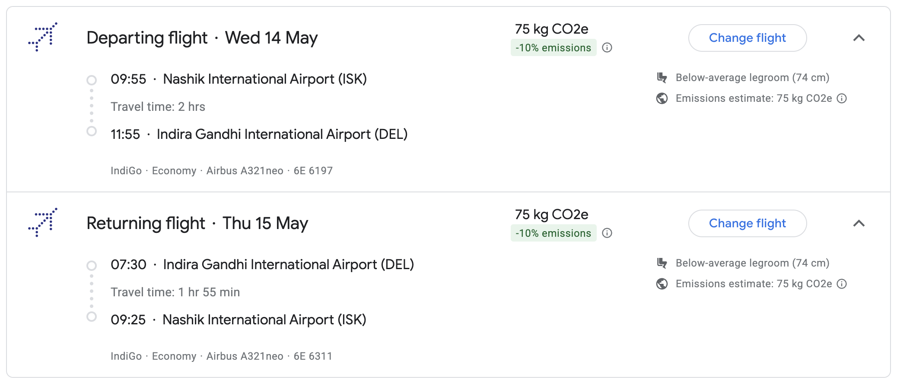
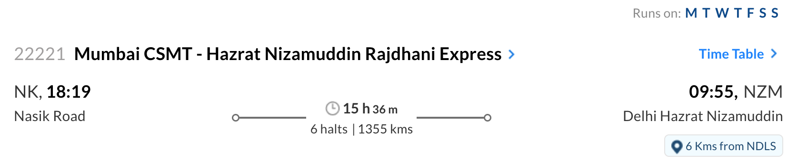
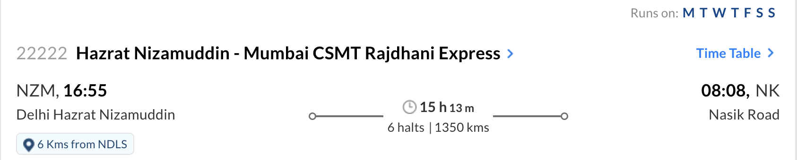

import { Aside } from '@astrojs/starlight/components';

## Event Location

The reception will be held at [**Manaktala Farms by Ambria**](https://www.getyourvenue.com/venue/manaktala-farms-wedding-venues-in-nh8-pushpanjali-south-delhi/), on **14th May, 2025 from 07:00 PM to 11:00 PM**.

<iframe src="https://www.google.com/maps/embed?pb=!1m18!1m12!1m3!1d3505.3074133590167!2d77.07823107608013!3d28.530478275720746!2m3!1f0!2f0!3f0!3m2!1i1024!2i768!4f13.1!3m3!1m2!1s0x390d1a337b4e96dd%3A0x7f6f1b3cf03e8bc1!2sManaktala%20Farms%20by%20Ambria!5e0!3m2!1sen!2sin!4v1740850664948!5m2!1sen!2sin" width="600" height="450" style="border:0;" allowfullscreen="" loading="lazy" referrerpolicy="no-referrer-when-downgrade"></iframe>

## Accomodation

Accomodation is arranged for guests coming from Nashik. If you are coming from other cities and need accomodation, please reach out to the hosts for assistance. Here is the Check-in and Check-out time:

| ***Check-in Time*** | ***Check-out Time*** |
| ---- | --- |
| **14th May, 2025 12:00 PM onwards** | **15th May, 2025 10:00 AM** |            

## Travel Guide

Delhi is very well connected by all means of transport. For guests coming from nearby cities like Kanpur, Jaipur, Gurgaon, Narnaul, etc., you can travel via train or via road. For guests coming from far off cities, you can book a flight to the Indira Gandhi International Airport. Here is a quick tool to help you find the right flight:

### Travel from Nashik

If you are travelling from Nashik, you can choose either flight or train to reach Delhi as per your convenience.

#### Via Direct Flight

If you are travelling from Nashik, you can book the following flights[[direct booking link](https://www.google.com/travel/flights/s/wqudYND5duroa2q17)]:

#### Via Train

For guests travelling to Delhi, we recommend travelling via **22221 Mumbai CSMT Rajdhani Express**. The train departs from **Nashik Road Railway Station at 06:19 PM on 13th May, 2025** and reaches **Hazrat Nizamuddin Railway Station at 09:55 AM on 14th May, 2025**.

<Aside title='Pick-up facility from Hazrat Nizamuddin Railway Station'>
For guests travelling via this particular train, we will arrange for a pick-up from the Hazrat Nizamuddin Railway Station to the hotel accomdation.
</Aside>

Guests can return via **22222 Mumbai CSMT Rajdhani Express** which departs from **Hazrat Nizamuddin Railway Station at 4:55 PM on 15th May, 2025**, and reaches **Nashik Road Railway Station at 08:08 AM on 16th May, 2025**.

