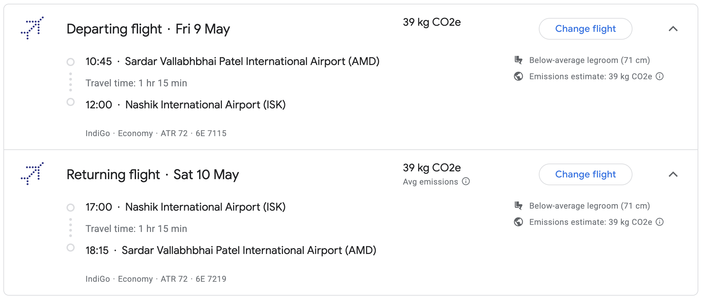

## Event location

All of the events will be held at the same location, [Aria Resort and Spa](https://arianashik.in/), on 9th and 10th May, 2025.

<iframe src="https://www.google.com/maps/embed?pb=!1m18!1m12!1m3!1d3749.0172411422254!2d73.66253757593235!3d20.007791081398167!2m3!1f0!2f0!3f0!3m2!1i1024!2i768!4f13.1!3m3!1m2!1s0x3bdded325dce5449%3A0xc96793e79d02dd5d!2sAria%20Resort%20%26%20Spa!5e0!3m2!1sen!2sin!4v1740845636401!5m2!1sen!2sin" width="600" height="450" style="border:0;" allowfullscreen="" loading="lazy" referrerpolicy="no-referrer-when-downgrade"></iframe>

## Event Itinerary

### Day 1: 09th May, 2025

The first day will be full of ceremonies and rituals. Here's the detailed itinerary:

| Time     | Event                          |
| :------- | :----------------------------- |
| 01:00 PM - 02:30 PM | Sagan and Engagement Ceremony |
| 03:30 PM - 05:00 PM | Haldi Ceremony                |
| 05:30 PM - 06:30 PM | Gharoli Ceremony (Groom side's event) |
| 08:00 PM - 10:00 PM | Sangeet Ceremony              |

### Day 2: 10th May, 2025

This is the big day! Here's the detailed itinerary:

| Time     | Event                          |
| :------- | :----------------------------- |
| 07:00 AM - 09:00 AM | Pheras |
| 11:00 AM - 01:00 PM | Varmala Ceremony |
| 02:00 PM - 04:00 PM | Reception Ceremony |

## Travel and Accomodation Guide

### Accomodation

For guests coming from out of town, we have arranged accomodation at the venue itself. Please reach out to the hosts if you need any assistance. Here is the Check-in and Check-out time:

| ***Check-in Time*** | ***Check-out Time*** |
| ---- | --- |
| **09th May, 2025 10:00 AM onwards** | **10th May, 2025 05:00 PM** |

We understand that for some guests travelling via flights or trains, there might be a need for late checkout. Please reach out to the hosts for any such requests so that we can make arrangements accordingly.

## Travel Guide

Here is a detailed travel guide for guests coming from different cities. You can also use this quick tool to find the best flight to reach Nashik.

### Travel from Ahmedabad

#### Via Flight (recommended)

You can take the following direct flights from Ahmedabad: 

The Nashik Ozhar International Airport has good cab connectivity and you could book Uber / Ola to the venue.

#### Via Road

You can take the NH48 route to reach Nashik. The journey will take around 8-10 hours.

#### Via Train

There are no direct trains from Ahmedabad to Nashik. If you prefer travelling via train, you can travel via train to Mumbai, Pune or Shirdi, and then take a connecting train to Nashik Road(NK).

### Travel from Bangalore
### Travel from Chennai
### Travel from Delhi
### Travel from Hyderabad
### Travel from Jaipur
### Travel from Kolkata
### Travel from Lucknow
### Travel from Kanpur
### Travel from Mumbai
### Travel from Patna
### Travel from Pune
### Travel from Varanasi
