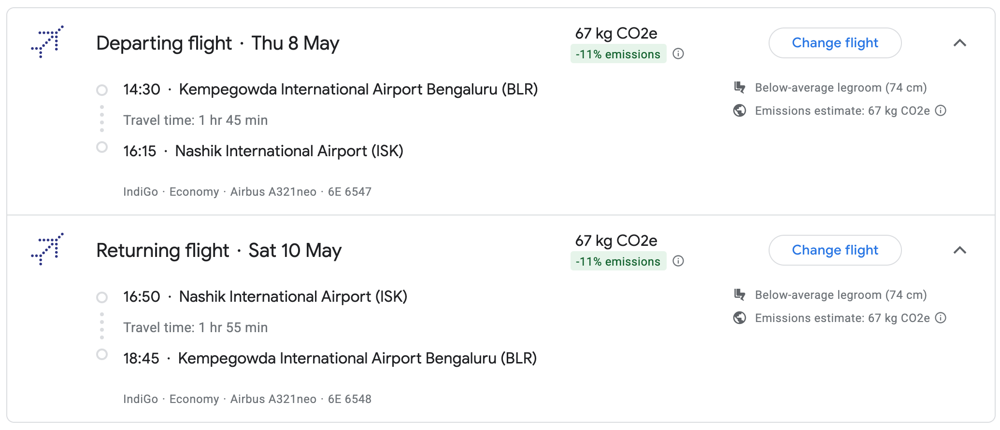

import { Aside } from '@astrojs/starlight/components';

## Event location

All of the events will be held at the same location, [Aria Resort and Spa](https://arianashik.in/), on 9th and 10th May, 2025.

<iframe src="https://www.google.com/maps/embed?pb=!1m18!1m12!1m3!1d3749.0172411422254!2d73.66253757593235!3d20.007791081398167!2m3!1f0!2f0!3f0!3m2!1i1024!2i768!4f13.1!3m3!1m2!1s0x3bdded325dce5449%3A0xc96793e79d02dd5d!2sAria%20Resort%20%26%20Spa!5e0!3m2!1sen!2sin!4v1740845636401!5m2!1sen!2sin" width="600" height="450" style="border:0;" allowfullscreen="" loading="lazy" referrerpolicy="no-referrer-when-downgrade"></iframe>

## Event Itinerary

### Day 1: 09th May, 2025

The first day will be full of ceremonies and rituals. Here's the detailed itinerary:

| Time     | Event                          |
| :------- | :----------------------------- |
| 12:00 PM - 01:30 PM | Sagan and Engagement Ceremony |
| 03:00 PM - 05:00 PM | Haldi Ceremony                |
| 05:00 PM - 06:00 PM | Gharoli Ceremony (Groom side's event) |
| 08:00 PM - 10:00 PM | Sangeet Ceremony              |

### Day 2: 10th May, 2025

This is the big day! Here's the detailed itinerary:

| Time     | Event                          |
| :------- | :----------------------------- |
| 07:30 AM - 10:30 AM | Vidhi/Pheras |
| 12:00 PM - 01:00 PM | Mangalashtak/Varmala |
| 01:00 PM - 04:00 PM | Reception |

## Travel and Accomodation Guide

### Accomodation

For guests coming from out of town, we have arranged accomodation at the venue itself. Please reach out to the hosts if you need any assistance. Here is the Check-in and Check-out time:

| ***Check-in Time*** | ***Check-out Time*** |
| ---- | --- |
| **09th May, 2025 10:00 AM onwards** | **10th May, 2025 05:00 PM** |

We understand that for some guests travelling via flights or trains, there might be a need for late checkout. Please reach out to the hosts for any such requests so that we can make arrangements accordingly.

## Travel Guide

Here is a detailed travel guide for guests coming from different cities. You can also use this quick tool to find the best flight to reach Nashik.

The Nashik Ozhar International Airport has good cab connectivity and you could book Uber / Ola to the venue.

### Travel from Bangalore

#### Via Flight (recommended)

You can book the following flights while travelling from Bangalore([direct booking link](https://www.google.com/travel/flights/s/E2o3Er8x9GzamCFM6)):

### Travel from Chennai
### Travel from Delhi

#### Via Train (recommended)

For guests travelling from Delhi, we recommend travelling via **22222 Mumbai CSMT Rajdhani Express**. The train departs from **Hazrat Nizamuddin Railway Station at 4:55 PM on 8th May, 2025**, and reaches **Nashik Road Railway Station at 08:08 AM on 09th May, 2025**, the day of the event.

<Aside title='Pick-up facility from Nashik Road Railway Station'>
For guests travelling via this particular train, we will arrange for a pick-up from the Nashik Road Railway Station to the venue.
</Aside>

#### Via Flight

For guests travelling from Delhi, we recommend taking the following flights([direct booking link](https://www.google.com/travel/flights/s/FRftuXNxKvPmoV9AA)):

We recommend taking the **return flight on 11th May, 2025** because the only direct flight to Delhi flies in the morning which conflicts with the event time.

<Aside title='Arrangements post checkout'>
Since this flight is post the checkout time of the venue, please let the hosts know if you are choosing this option to make sure we can make arrangements for overnight stay in Nashik accordingly
</Aside>

### Travel from Jaipur

### Travel from Mumbai

### Travel from Varanasi
